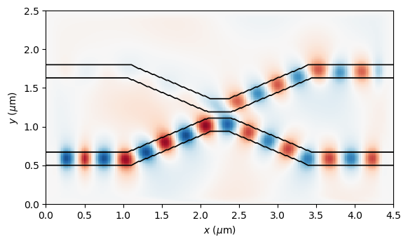

# FDFD.jl

FDFD.jl is a 2D finite difference frequency domain (FDFD) code written completely in Julia for solving Maxwell's equations. It also supports performing the linear solve steps with the Pardiso and MUMPS packages.

## Usage
I will eventually develop better documentation for the package but for now, please see the included [Example_simulations.ipynb](http://nbviewer.jupyter.org/github/fancompute/FDFD.jl/blob/master/notebooks/Example_simulations.ipynb) notebook to get started with some barebones examples.

I've detached the plotting functions into a separate module [FDFDViz.jl](https://github.com/fancompute/FDFDViz.jl) to remove the PyPlot requirement.

## TODO
- [x] Update for Julia 0.7/1.0
- [x] Add support for MUMPS solver and allow user to select between MUMPS, Pardiso, and the Julia \ command
   - [ ] Determine why MUMPS will not parallelize
- [x] Implement the frequency eigenvalue solver
- [ ] Implement TE polarization
   - [x] Add for eigenfrequency()
   - [x] Add for solve()
   - [ ] Add for modulated solve()
- [x] Investigate and develop a better data struct for storing the fields
   - [x] FieldTM and FieldTE
   - [x] Cleaned up Flux calculation
- [ ] Stored grid values
- [ ] Calculate S-parameters
- [ ] GeometryPrimitives 2D vs 3D shape handling

## About
The FDFD algorithm implemented here was originally developed by Jerry Shi and Wonseok Shin from Shanhui Fan's [research group](http://web.stanford.edu/group/fan/) at Stanford University. This code implements a version of the multi-frequency finite-difference frequency domain (MF-FDFD) method [1]. There are two MATLAB implementations of FDFD available which are likely to be more functional than this package. Note that there is also a work-in-progress FDFD Julia package being developed. See below for links to these projects.

 * [fdfd_suite](https://github.com/YuJerryShi/fdfd_suite) by Jerry
 * [MaxwellFDM.jl](https://github.com/wsshin/MaxwellFDM.jl) by Wonseok
 * [maxwellfdfd](https://github.com/wsshin/maxwellfdfd) by Wonseok

 ## References
  1. Yu Shi, Wonseok Shin, and Shanhui Fan, "[Multi-frequency finite-difference frequency-domain algorithm for active nanophotonic device simulations](https://doi.org/10.1364/OPTICA.3.001256)," Optica 3, 1256-1259 (2016)
